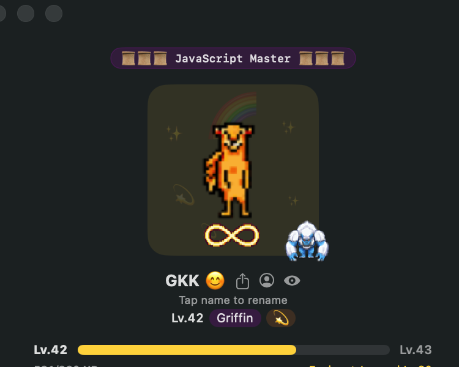
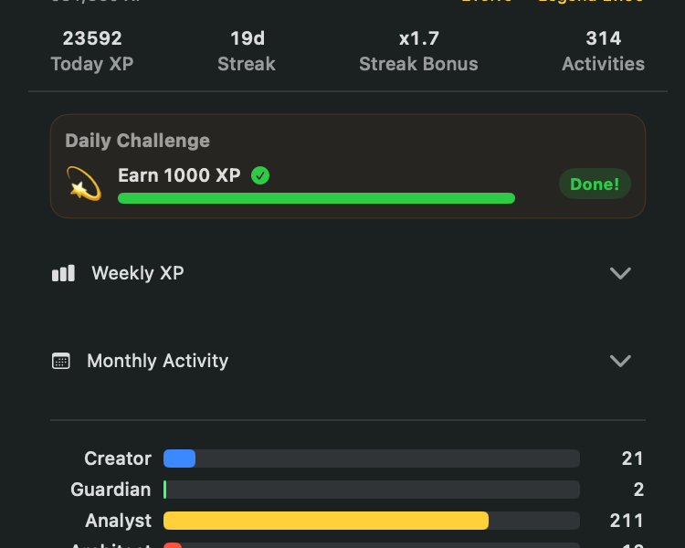
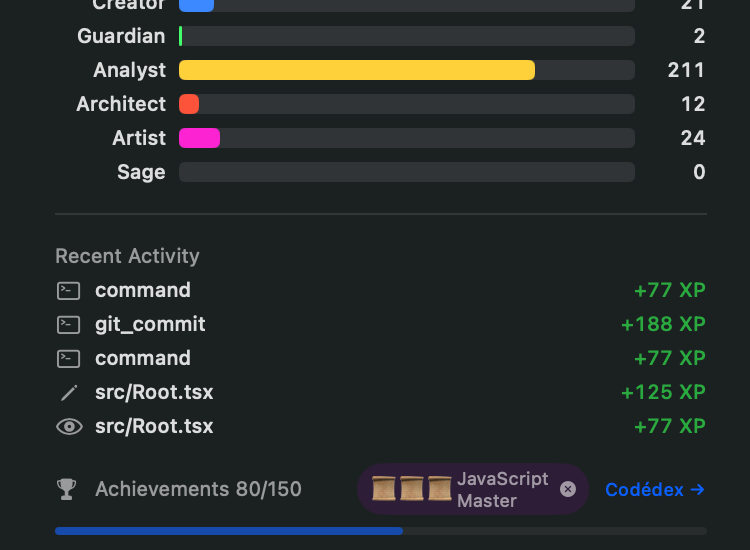
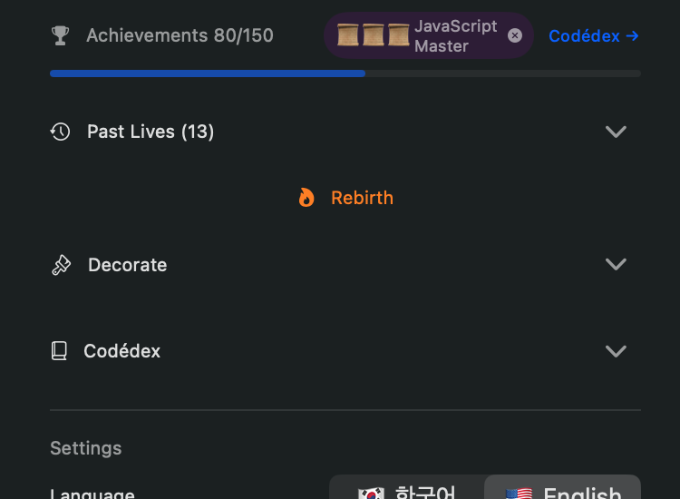
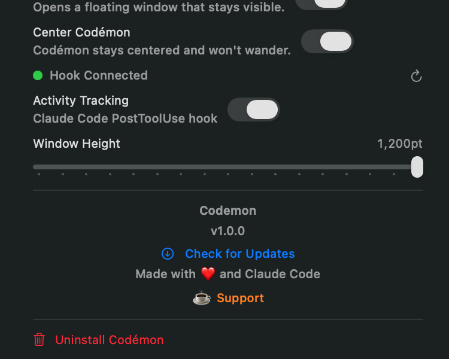

  

  # Codemon

  **Your coding companion that grows as you code.**

  A macOS menu bar app that raises a virtual pixel creature powered by your real coding activity.

   

  

  
  
  

---

[한국어](README_ko.md) | English

---

**6 Evolution Stages** | **100 Unique Creatures** | **XP from Real Coding**

---

## Installation

1. Download the latest `Codemon-x.x.x.dmg` from [Releases](https://github.com/gtpgg1013/codemon/releases/latest)
2. Open the DMG and drag Codemon to Applications
3. Launch Codemon — it appears in your menu bar; a **Separate Window** mode is also available if you prefer a floating panel
4. Click **Install Hook** in the onboarding flow to connect Codemon with your coding tool

## Supported Tools

| Tool | Status |
|------|--------|
| Claude Code (CLI) | ✅ |
| Cursor | ✅ |
| VS Code + Claude Extension | ✅ |

## How It Works

  

1. **Activity Detection** — Codemon monitors hook events fired by your coding tool in real time.
2. **Classification** — Each event is classified into an activity type (code generation, test writing, search, refactor, etc.).
3. **XP Award** — Base XP ranges from 10–60 depending on activity type, plus a daily bonus and a streak multiplier of up to 2.0x.
4. **Tendency Building** — Activities accumulate points across 6 tendencies that shape your creature's personality:
   - **Creator** — generates and writes new code
   - **Guardian** — tests, reviews, and protects quality
   - **Analyst** — searches, reads, and investigates
   - **Architect** — plans, structures, and refactors
   - **Artist** — crafts UI, styles, and visual elements
   - **Sage** — documents, explains, and teaches
5. **Evolution** — When your cumulative XP crosses a threshold, Codemon evolves and a unique creature variant is assigned for that stage.

  

## Evolution Stages

| Stage | XP Required | Approximate Level |
|-------|-------------|-------------------|
| Egg | 0 | 1 |
| Baby | 200 | ~5 |
| Youth | 1,000 | ~11 |
| Adult | 4,000 | ~23 |
| Elder | 12,000 | ~42 |
| Legend | 35,000 | ~73 |

There are **100 unique creatures** spread across all evolution stages — the variant assigned at each evolution is drawn at random.

## Achievements & Rebirth

  

### Achievements

Codemon includes **30 achievements** across four categories:

- **Activity milestones** — rewards for reaching XP and tool-use counts
- **Streak rewards** — bonuses for consecutive days of coding
- **Evolution milestones** — unlocked as your creature advances through stages
- **Special** — hidden achievements for unusual or exceptional coding patterns

### Rebirth System

Once your creature reaches a high level, you can trigger a **Rebirth**:

- Level and XP reset to the beginning
- A permanent prestige bonus is applied to future XP gains
- Your past life is recorded in the **Past Lives** log
- Access Rebirth from the **Action** tab

## Daily Challenges & Events

- **Daily missions** — a fresh set of objectives resets every day, offering bonus XP for completing them
- **Random events** — surprise in-session bonuses triggered by coding activity
- **Seasonal events** — special holiday themes and bonus multipliers throughout the year

## Decorations & Titles

Collect **55 decorations** to customize your creature's environment. Decorations come in five rarity tiers:

| Rarity | Color |
|--------|-------|
| Common | Gray |
| Uncommon | Green |
| Rare | Blue |
| Epic | Purple |
| Legendary | Gold |

Equip decorations from the **Decorate** tab. Titles earned through achievements can be displayed from the **Action** tab.

## Settings

  

| Setting | Description |
|---------|-------------|
| Language | English / 한국어 |
| Sound Effects | Toggle audio feedback for level-ups and events |
| Launch at Login | Start Codemon automatically when you log in |
| Separate Window | Open Codemon as a floating window instead of a popover |
| Codemon stays centered | Lock the sprite to the center of the window |
| Activity Tracking | Enable or disable XP tracking entirely |
| Window Height | Adjust the height of the Codemon panel |

## Security

- All activity data is encrypted with AES-GCM; Apple Silicon devices use the Secure Enclave for key storage
- Hook events are cryptographically signed; Codemon verifies the signing identity and parent process before accepting any event
- Activity logs are protected by a SHA-256 hash chain for tamper detection
- No accounts, no cloud sync, no telemetry — all data lives on your machine

## Requirements

- macOS 14.0 (Sonoma) or later
- Apple Silicon or Intel Mac (2018 or later)

## Auto-Update

Codemon uses [Sparkle](https://sparkle-project.org/) for automatic update checks. You will be notified in-app when a new version is available.

## Bug Reports & Feedback

Found a bug? Want to suggest a feature? Please [open an issue](https://github.com/gtpgg1013/codemon/issues/new) — it really helps!

## License

Proprietary. All rights reserved.

---

[Support on Ko-fi](https://ko-fi.com/codemon)

